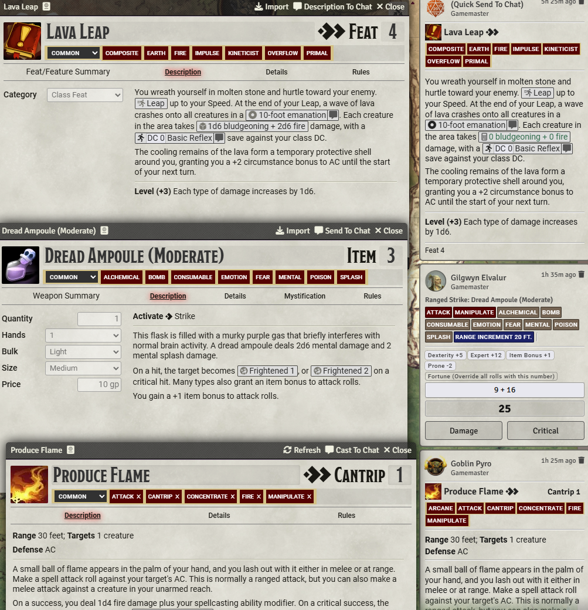
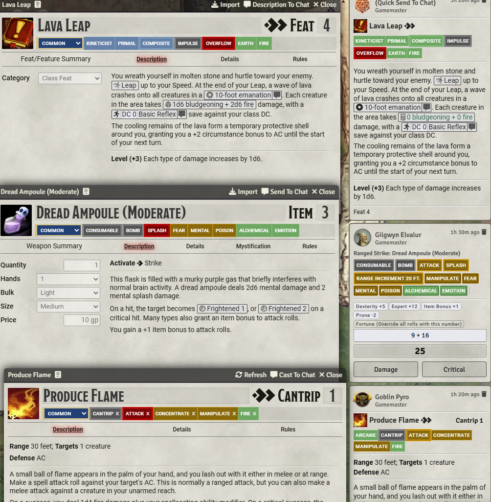
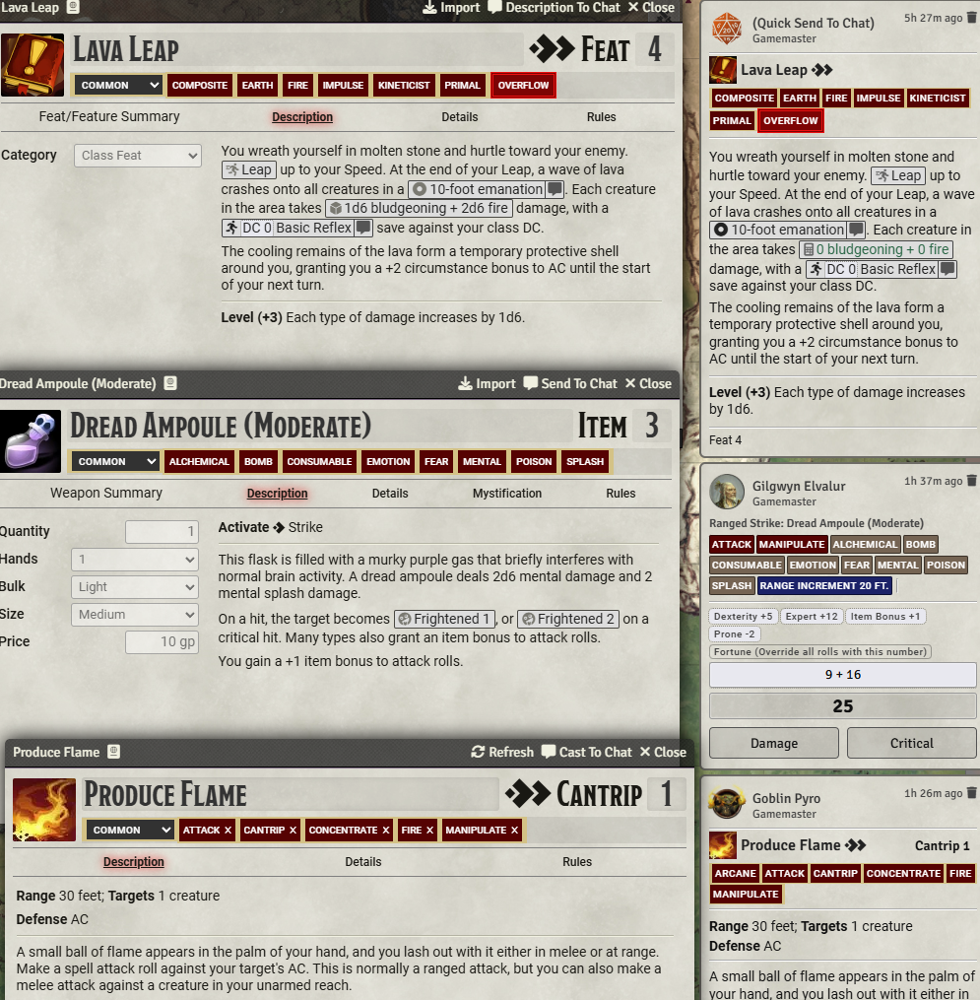

# [PF2E Technicolor Traits](https://foundryvtt.com/packages/pf2e-technicolor-traits/)

FoundryVTT module for the PF2e system, showing color-coded traits, making the tags of spells/feats/items easier to
figure out at a glance.

To install, browse for it in the module browser,
or [directly copy the manifest link for the latest release](https://github.com/shemetz/pf2e-technicolor-traits/releases/latest/download/module.json)
.

## Features

Mode: Disabled

Mode: Fully Enabled

Mode: Only highlight the most important traits

When fully enabled (the default mode), this module will:

1. Assign a category to each trait, based on what it does and where it appears.
2. Reorder the traits based on the order of the categories, rather than alphabetically.
    1. This order is intended to be intuitive, and approximately goes:  "defining categories, then important traits,
       then unimportant traits".
3. Style the traits based on their category.
    1. Color-coding important traits in red/orange and unimportant traits in green/blue.
    2. Traits with rules will have a thick and visible border; traits without will have a thin dashed border.

## The Trait Categories

| Trait Category                  | Description                                                  | Example traits                               | Color (importance)                    | Border (rules) |
|---------------------------------|--------------------------------------------------------------|----------------------------------------------|---------------------------------------|----------------|
| Rarity                          | Traits that describe how common or rare the item is.         | Common, Rare, Unique                         | 🟦 Blue in header, 🟩 green elsewhere | Thin           |
| Origin                          | Traits that describe the origin of the item.                 | General, Skill, Wizard, Elf, Fiend           | 🟦 Blue in header, 🟩 green elsewhere | Thin           |
| Sub-Origin                      | Traits that describe the sub-origin of the item.             | Arcane, Divine, Chaotic, Devil, Werecreature | 🟦 Blue in header, 🟩 green elsewhere | Thin           |
| Build Limitation                | Traits that limit the build or usage of the item.            | Dedication, Aftermath, Composite, Oath       | 🟦 Blue in header, 🟩 green elsewhere | Thick          |
| Type Mechanic                   | Traits that describe the general type of a thing.            | Cantrip, Focus, Impulse, Consumable, Staff   | ⬜ Grey                                | Thick          |
| Subtype Mechanic                | Traits that describe the subtype of a thing.                 | Spellshape, Bravado, Hex, Grimoire           | ⬜ Grey                                | Thick          |
| **Important Mechanic**          | Traits that are critical to know about.                      | Incapacitation, Unstable, Flourish, Subtle   | 🟥 Red                                | Thick          |
| Important Mechanic Outside Chat | Attack, plus major weapon traits.                            | Attack, Thrown, Brutal, Splash               | 🟥 Red in header, orange elsewhere    | Thick          |
| Occasional Mechanic             | Traits that have rules but are only occasionally meaningful. | Visual, Nonlethal, clockwork, Aquadynamic    | 🟧 Orange                             | Thick          |
| Common Trigger                  | Traits that are commonly referenced by other abilities.      | Concentrate, Manipulate, Mental, Move        | 🟧 Orange                             | Thin           |
| Mostly Fluff                    | Traits that have rules but are rarely important.             | Esoterica, Light, Processed                  | 🟩 Green                              | Thick          |
| Very Fluff                      | Traits that are used for flavor and have no rules.           | Fire, Prediction, Steam, Gadget              | 🟩 Green                              | Thin           |
| User Custom                     | Traits that are user-customizable.                           | User-defined traits                          | 🏳️‍🌈 Rainbow                        | Thick          |
